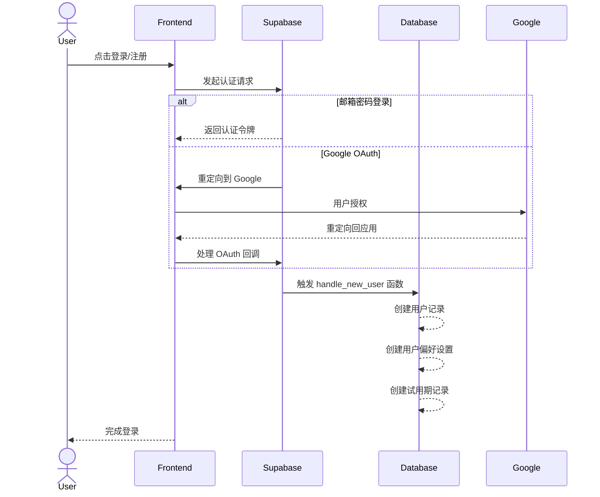
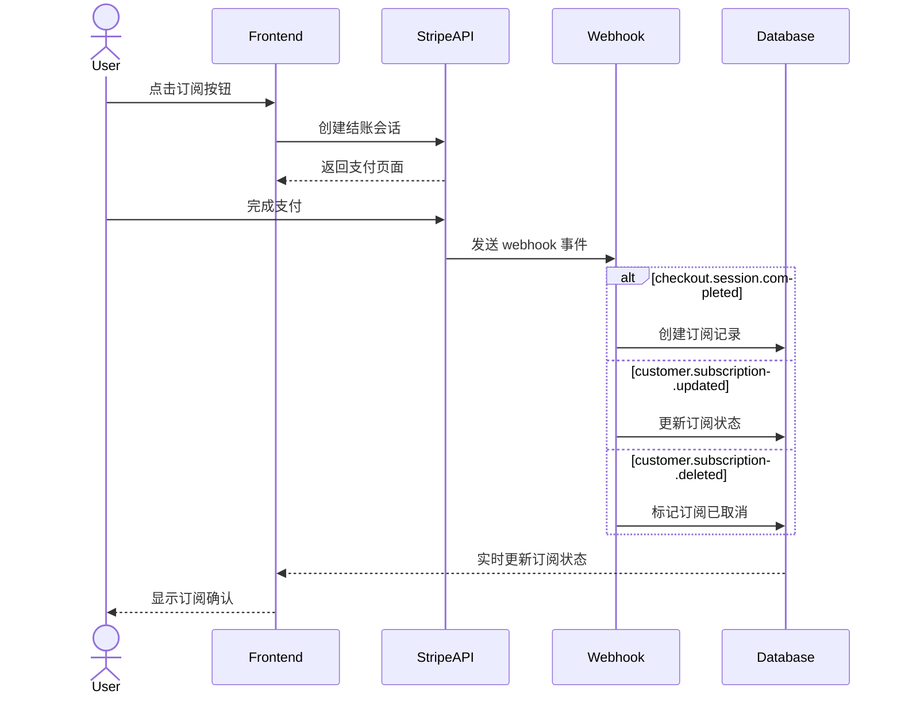
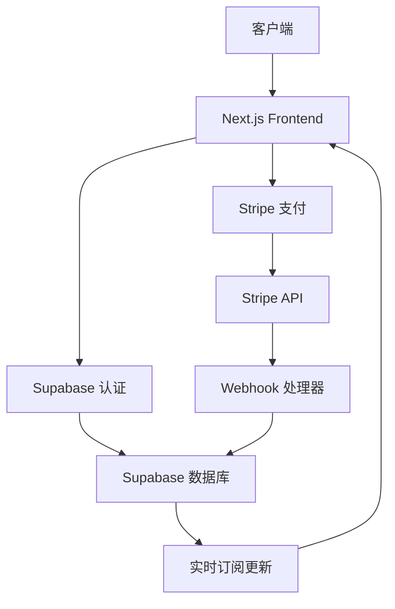

# 技术架构文档

## 项目概述
这是一个集成了 Next.js、Stripe 支付和 Supabase 认证的全栈应用模板。主要功能包括用户认证、订阅支付和暗黑模式等。

## 环境配置

### Supabase 配置
1. 创建 Supabase 项目并获取以下配置信息：
   - `NEXT_PUBLIC_SUPABASE_URL`: Supabase 项目 URL
   - `NEXT_PUBLIC_SUPABASE_ANON_KEY`: 匿名公钥
   - `SUPABASE_SERVICE_ROLE_KEY`: 服务角色密钥

2. 配置认证服务：
   - 启用邮箱密码认证
   - 配置 OAuth 提供商（如 Google）
   - 设置项目 URL 和重定向 URL

### Stripe 配置
1. 创建 Stripe 账户并获取以下密钥：
   - `NEXT_PUBLIC_STRIPE_PUBLISHABLE_KEY`: 可发布密钥（支持 test/live 环境）
   - `STRIPE_SECRET_KEY`: 私密密钥
   - `NEXT_PUBLIC_STRIPE_BUTTON_ID`: 支付按钮 ID

2. Webhook 配置：
   - 设置 Webhook 端点：`your_domain/api/stripe/webhook`
   - 获取 `STRIPE_WEBHOOK_SECRET`
   - 订阅事件：customer.subscription.*, checkout.session.*, invoice.*

## 核心文件结构

### Supabase 相关文件
- `/utils/supabase.ts` - Supabase 客户端配置
- `/utils/supabase-admin.ts` - Supabase 管理员客户端配置
- `/contexts/AuthContext.tsx` - 认证上下文和用户状态管理
- `/app/auth/callback/` - OAuth 回调处理
- `/hooks/useAuth.ts` - 认证相关钩子
- `/app/reset-password/` - 密码重置
- `/app/update-password/` - 密码更新

### Stripe 相关文件
- `/app/api/stripe/webhook/route.ts` - Stripe Webhook 处理
- `/app/api/stripe/cancel/route.ts` - 取消订阅
- `/app/api/stripe/reactivate/route.ts` - 重新激活订阅
- `/app/api/stripe/sync/route.ts` - 同步订阅状态
- `/hooks/useSubscription.ts` - 订阅管理钩子
- `/components/StripeBuyButton.tsx` - Stripe 支付按钮

## 数据库表结构

### 主要表
- `auth.users` - Supabase 认证用户表
- `public.users` - 用户信息表
  - `id`: uuid (主键，关联 auth.users)
  - `email`: text
  - `created_at`: timestamp
  - `updated_at`: timestamp
  - `is_deleted`: boolean
  - `deleted_at`: timestamp
  - `reactivated_at`: timestamp

- `public.user_preferences` - 用户偏好设置表
  - `id`: uuid (主键)
  - `user_id`: uuid (外键关联 auth.users)
  - `has_completed_onboarding`: boolean
  - `created_at`: timestamp
  - `updated_at`: timestamp

- `public.user_trials` - 试用期信息表
  - `id`: uuid (主键)
  - `user_id`: uuid (外键关联 auth.users)
  - `trial_start_time`: timestamp
  - `trial_end_time`: timestamp
  - `is_trial_used`: boolean

- `public.subscriptions` - 订阅信息表
  - `id`: uuid (主键)
  - `user_id`: uuid (外键关联 users)
  - `stripe_customer_id`: text
  - `stripe_subscription_id`: text
  - `status`: text
  - `price_id`: text
  - `created_at`: timestamp
  - `cancel_at_period_end`: boolean
  - `updated_at`: timestamp
  - `current_period_end`: timestamp

## 认证流程

## 支付流程

## 系统架构图

## 安全考虑
- Row Level Security (RLS) 策略
  - 用户只能访问自己的数据
  - 服务角色可以访问所有数据
- Webhook 签名验证
  - 验证 Stripe webhook 请求的真实性
  - 使用 `STRIPE_WEBHOOK_SECRET` 进行签名验证
- 环境变量管理
  - 敏感配置信息存储在环境变量中
  - 区分开发和生产环境的密钥
- 软删除机制
  - 用户删除时保留数据但标记为已删除
  - 支持数据恢复和重新激活

## 关键功能实现

### 用户认证
1. 支持多种认证方式
   - 邮箱密码登录
   - Google OAuth 登录
   - 魔法链接登录
2. 认证状态管理
   - 使用 React Context 管理用户状态
   - 自动刷新认证令牌
   - 处理会话过期
3. 用户配置文件
   - 自动创建用户记录
   - 管理用户偏好设置
   - 支持用户资料更新

### 订阅管理
1. 订阅状态同步
   - Webhook 处理各种订阅事件
   - 定期同步订阅状态
   - 处理支付失败和重试
2. 试用期管理
   - 自动创建试用期记录
   - 跟踪试用期状态
   - 试用期到期提醒
3. 订阅操作
   - 取消订阅
   - 重新激活订阅
   - 订阅升级/降级
   - 订阅状态实时更新

### 实时更新
1. 数据库变更订阅
   - 使用 Supabase 实时订阅功能
   - 监听订阅状态变更
   - 处理断线重连
2. 状态缓存
   - 使用内存缓存减少请求
   - 定期刷新确保数据最新
   - 优化前端性能
